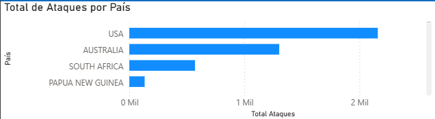
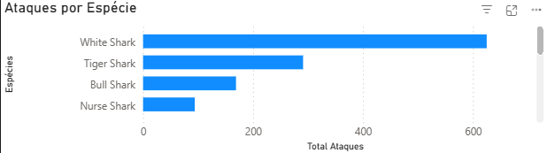
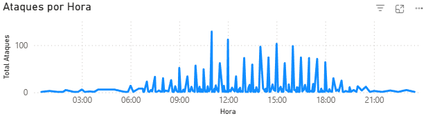
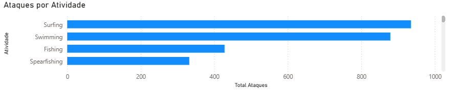

# 🦈 Análise de Ataques de Tubarão

Projeto de análise exploratória e visualização de dados sobre ataques de tubarão ao redor do mundo, utilizando Python para tratamento dos dados e Power BI para construção de dashboards interativos.

---

## 🎯 Objetivo do Projeto

O objetivo deste projeto é analisar padrões de ataques de tubarão considerando localização, espécie, horário, atividade da vítima e taxa de fatalidade, buscando identificar comportamentos e contextos com maior risco de ocorrência.

---

## 🛠 Ferramentas Utilizadas

- Python (Pandas, NumPy)
- Power BI
- Git & GitHub

---

## 📂 Dataset

O conjunto de dados utilizado contém registros históricos de ataques de tubarão em diversos países, incluindo informações como:

- País  
- Espécie do tubarão  
- Atividade da vítima  
- Horário do ataque  
- Ano  
- Tipo de ferimento  
- Indicador de fatalidade  

Fonte: Maven Analytics / Global Shark Attack File.

---

## 🧹 Resumo de Limpeza dos Dados (Python)

Durante o pré-processamento dos dados foram realizadas as seguintes etapas:

- Remoção de registros nulos e duplicados.  
- Padronização de nomes de espécies.  
- Conversão do campo de horário para formato numérico (hora).  
- Criação de métricas derivadas, como taxa de fatalidade.  
- Tratamento de valores inconsistentes e outliers.  

---

## 📊 Dashboards Construídos (Power BI)

Abaixo estão alguns dos principais visuais do dashboard.

### 🌍 Ataques por País


Mostra os países com maior número de ataques registrados.

---

### 🦈 Ataques por Espécie


Apresenta as espécies mais frequentemente associadas aos incidentes.

---

### ⏰ Distribuição por Horário


Exibe os períodos do dia com maior concentração de ataques.

---

### 🏄 Atividade das Vítimas


Relaciona o tipo de atividade praticada no momento do ataque.

---

## 📤 Entregáveis Finais

- Notebook com análise e tratamento dos dados.  
- Dataset tratado.  
- Dashboard interativo em Power BI.  
- Documentação do projeto no GitHub.  

---

## 💡 Principais Insights

- A maioria dos ataques se concentra em poucos países costeiros.  
- Certas espécies estão associadas a maiores taxas de fatalidade.  
- Há maior ocorrência de ataques em horários específicos do dia.  
- Atividades recreativas concentram grande parte dos incidentes.  

---

## 📁 Estrutura do Projeto

```text
shark-attacks-analysis/
├── data/
│   └── attacks.csv
├── notebook/
│   └── analysis.ipynb
├── images/
├── powerbi/
│   └── dashboard.pbix
└── README.md

---

## 👤 Autor

Deivisson Gomes dos Santos  
Analista de Dados Júnior | Python • SQL • Power BI  
UNEB  

LinkedIn: https://www.linkedin.com/in/deivisson-gomes-809160155/  
GitHub: https://github.com/dsgomess  

